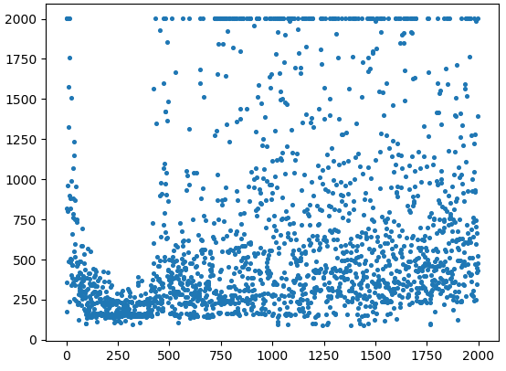
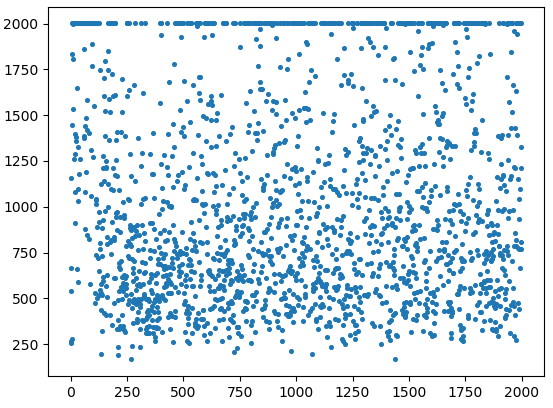

# ML-DL-RL-AutoML
machine learning/deep learning/reinforcement learning/autoML

## ML

## DL

## RL
### Deep-Q-Network
algorithm:

result on CartPole:

result on MountainCar: ##learning rate = 0.01, gamma = 0.9, episodes = 3000, steps of every episode = 2000, start learning steps(episode) = 200, set_replace_target_iter = 200

result on MountainCar: ##learning rate = 0.01, gamma = 0.9, episodes = 3000, steps of every episode = 2000, start learning steps(episode) = 100, set_replace_target_iter = 200

result on MountainCar: ##learning rate = 0.001, gamma = 0.9, episodes = 3000, steps of every episode = 2000, start learning steps(episode) = 0, set_replace_target_iter = 200

result on MountainCar: ##learning rate = 0.001, gamma = 0.9, episodes = 3000, steps of every episode = 2000, start learning steps(episode) = 0, set_replace_target_iter = 2000

result on MountainCar: ##learning rate = 0.001, gamma = 0.9, episodes = 3000, steps of every episode = 2000, start learning steps(episode) = 0, set_replace_target_iter = 5step

we can see that different start_learning_step leads to totally different results

### Actor-Critic
algorithm:

result on CartPole:
learning rate of Actor = 0.001, learning rate of Critic = 0.01, Gamma = 0.8
episodes = 3000, steps of every episode = 1000

function run_double build positive and negative network, but the result is still not so good as positive only network

result of function run_double train positive network only on CartPole:

result of function run_double train positive and negative network on CartPole:

result of run_pendulum_on_ac_step_by_step(update step by step, quantization):
episode=2000, reward=(-1, 0), action_space=401. We really have a bad result.

result of run_pendulum_on_ac_continously(update continously, not quantization):

## AutoML
